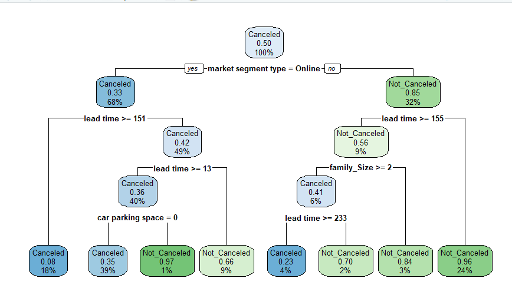
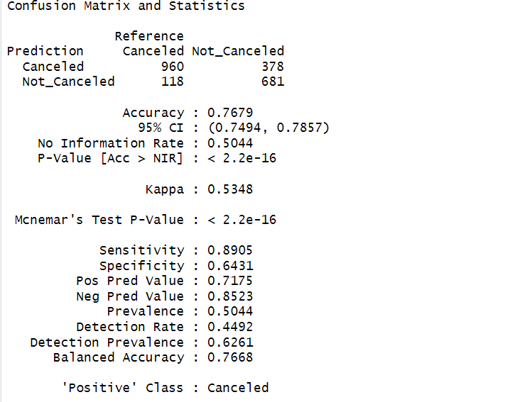

# Hotel Booking Cancellation Prediction

## Project Overview

This project focuses on predicting hotel booking cancellations using a Decision Tree classification model in R. The objective is to identify booking patterns and classify whether a hotel reservation is likely to be canceled based on customer and booking-related information.

The project includes data preprocessing, exploratory data analysis (EDA), model building, and model evaluation.

---

## Objectives

- Predict hotel booking cancellations using machine learning.
- Perform exploratory data analysis on hotel booking data.
- Build a Decision Tree classification model.
- Evaluate the model using a confusion matrix.

---

## Tools & Technologies

- R
- RStudio
- Decision Tree (CART)
- rpart
- rpart.plot
- caret
- dplyr

---

## Dataset

The dataset contains hotel reservation information, including customer details, booking information, room type, lead time, market segment, meal plan, and booking status.

**Target Variable:** Booking Status

---

## Project Workflow

- Data Collection
- Data Cleaning & Preprocessing
- Exploratory Data Analysis (EDA)
- Decision Tree Model Development
- Model Evaluation
- Result Interpretation

---

## Repository Structure

```
Hotel-Booking-Cancellation-Prediction
│
├── Dataset
│   └── hotel_booking.csv
│
├── Images
│   ├── decision_tree.png
│   └── confusion_matrix.png
│
├── Report
│   └── Hotel Booking Cancellation Prediction.pdf
│
└── README.md
```

---

## Decision Tree



---

## Confusion Matrix



---

## Key Skills Demonstrated

- Predictive Analytics
- Machine Learning
- Decision Tree Classification
- Data Preprocessing
- Exploratory Data Analysis (EDA)
- Model Evaluation
- R Programming

---

## Report

A detailed academic project report is available in the **Report** folder.

---

## Author

**Krishna Ramesh**
